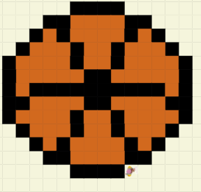

# Unit 1 - Asphalt Art

## Introduction

Cities use asphalt art to improve public safety, inspire their residents and visitors, and brighten communities. Your goal is to create asphalt art to revitalize The Neighborhood and bring the community together with the help of the Painter.

## Requirements

Use your knowledge of object-oriented programming, algorithms, the problem solving process, and decomposition strategies to create asphalt art:
- **Create a new subclass** – Create at least one new subclass of the PainterPlus class that is used for a component of the asphalt art design.
- **Plan an algorithm** – Use the problem solving process and decomposition strategies to plan an algorithm that incorporates a combination of sequencing, selection, and/or iteration.
- **Write a method** – Write at least one method in a PainterPlus subclass that contributes to a component of the asphalt art design.
- **Document your code** – Use comments to explain the purpose of the methods and code segments.

## Notes: Neighborhood & Painter Class

This project was created on Code.org's JavaLab platform using the built in Neightborhood GUI output. To test and edit this project you must build in Code.org's JavaLab with the Neighborhood GUI enabled. For reference to the Painter class documentation, [you can read more here.](https://studio.code.org/docs/ide/javalab/classes/Painter)

## Output:
### Here is an image of my project 
 

## Reflection

1. Describe your project.

   - In this project, my goal was to utilize the newfound knowledge of the java language to instantiate different objects of different classes each with different methods, to perform the task of creating an image. In my project, I chose to paint a basketball as I felt it represented one of my passions. 

2. What are two things about your project that you are proud of?

   - Personally I am proud of the efficiency of my project and how quickly I was able to complete it. Additionally, I am quite pleased with how my painting looks. At first I was unsure if people would think it is a basketball however, whenever I decided to boast about my project, the feedback was positive.

3. Describe something you would improve or do differently if you had an opportunity to change something about your project.

   - I think if the processing speed of my computer functioned properly I would have liked to challenge myself with a larger grid to paint a bigger picture. I think if I did do this I could make a more detailed basketball with a seam running down the middle making it more evident the painting is actually a basketball.
